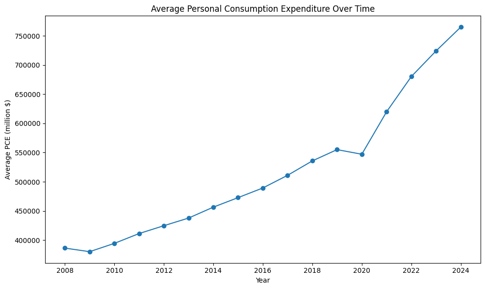
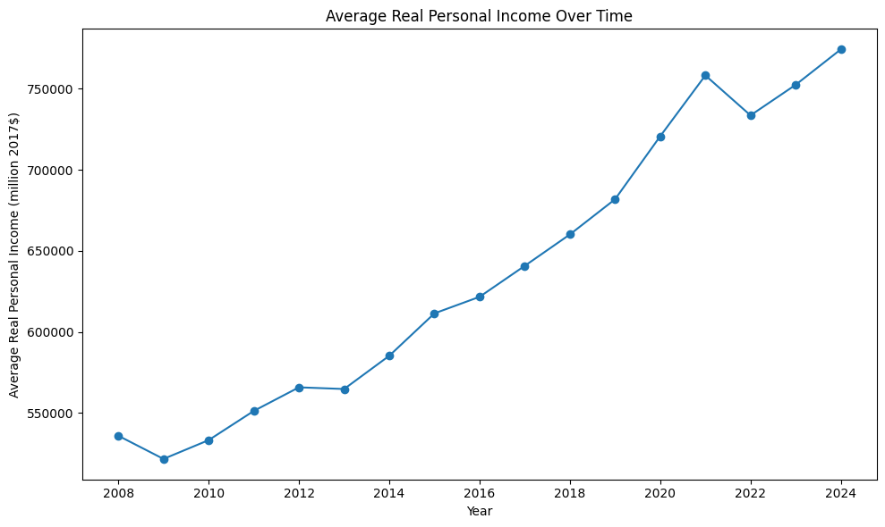
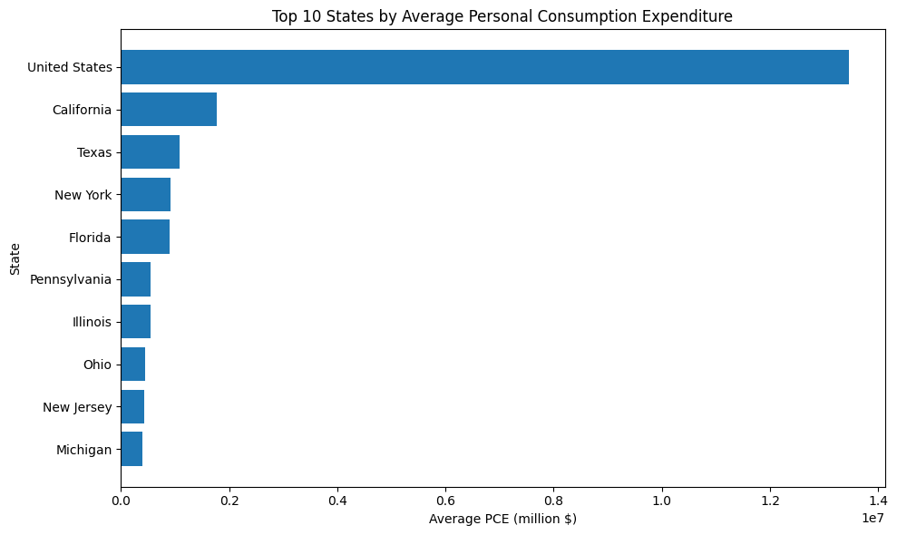

# Household Consumption and Income Dynamics

**Panel-data econometric analysis of household consumption and real personal income across U.S. entities, 2008–2024.**

[](https://www.python.org/)
[](https://jupyter.org/)
[](https://colab.research.google.com/)

---

## 📌 Project Overview

This project examines the relationship between **real personal income and household consumption** using annual panel data across U.S. entities from **2008 to 2024**.

The analysis applies several panel-data econometric specifications to investigate how the estimated income-consumption relationship changes when accounting for:

- entity-specific and year-specific effects
- logarithmic transformations
- dynamic persistence
- variable scaling
- alternative model assumptions

The project was developed as part of my Master's research in **Data Analysis in Business**.

---

## 🎯 Research Objective

The main research question is:

> **How is real personal income associated with household consumption across U.S. entities over time?**

The analysis also examines how sensitive this relationship is to different econometric specifications and whether Fixed Effects or Random Effects provides the more appropriate framework for the main log-linear model.

---

## 📊 Project Snapshot

| Aspect | Details |
|---|---|
| **Period** | 2008–2024 |
| **Observations** | 884 |
| **Entities** | 52 |
| **Main outcome** | Personal Consumption Expenditure |
| **Main predictor** | Real Personal Income |
| **Data type** | Annual panel data |
| **Main framework** | Fixed Effects |
| **Programming language** | Python |

---

## 🧪 Methodology

The analysis combines descriptive, exploratory, and econometric methods.

| Analysis | Purpose |
|---|---|
| **Descriptive statistics** | Examine the distribution of the main economic variables |
| **Correlation analysis** | Assess relationships and potential multicollinearity among aggregate variables |
| **Fixed Effects** | Control for unobserved entity-specific and year-specific factors |
| **Random Effects** | Provide an alternative panel-data specification |
| **Log-linear model** | Estimate the income-consumption elasticity |
| **Dynamic Fixed Effects** | Account for persistence in consumption over time |
| **Per-worker robustness model** | Examine sensitivity to differences in entity size |
| **Hausman test** | Compare Fixed Effects and Random Effects specifications |

Clustered standard errors by entity are used in the Fixed Effects models.

---

## 🔎 Key Findings

### Income and consumption

The main log-linear Fixed Effects model estimates an income-consumption elasticity of **0.6867**.

A 1% increase in real personal income is associated with approximately a **0.69% increase in personal consumption expenditure**, holding entity and year effects fixed.

> This is a statistical association, not a causal estimate.

### Consumption persistence

The dynamic Fixed Effects model estimates a lagged consumption coefficient of approximately **0.7894**, indicating strong persistence in consumption over time.

After accounting for lagged consumption, the real personal income coefficient falls from **0.6867 to 0.1963**.

### Robustness to variable scaling

The per-worker specification produces an elasticity of **0.3203**.

The positive association remains, but the magnitude changes when the variables are scaled by employment, showing that the estimated relationship is sensitive to how the economic variables are measured.

### Fixed Effects vs. Random Effects

The Random Effects model estimates an elasticity of **0.9827**, compared with **0.6867** under Fixed Effects.

The Hausman test produces:

| Statistic | Value |
|---|---:|
| Hausman statistic | 70.0301 |
| Degrees of freedom | 1 |
| p-value | < 0.001 |

The null hypothesis is rejected, providing evidence in favor of **Fixed Effects** for the main log-linear comparison.

### High correlation among aggregate variables

Several aggregate economic variables are extremely highly correlated:

| Variable pair | Correlation |
|---|---:|
| Real Personal Income — Real GDP | 0.9991 |
| Real Personal Income — Employment | 0.9975 |
| PCE — Real Personal Income | 0.9943 |

This high correlation helps explain why coefficient estimates change substantially across model specifications.

---

## 📈 Visualizations

### Real Personal Income vs. Consumption


### Average Consumption Over Time



### Average Real Personal Income Over Time



### Top 10 Entities by Average Consumption



---

## 📋 Exported Results

Selected analysis outputs are available as CSV files:

- [Descriptive statistics](results/tables/descriptive_statistics.csv)
- [Correlation matrix](results/tables/correlation_matrix.csv)
- [Model comparison](results/tables/model_comparison.csv)

---

## 🛠️ Tools

- **Python**
- **Pandas**
- **NumPy**
- **SciPy**
- **Matplotlib**
- **linearmodels**
- **Google Colab**
- **GitHub**

---

## 📁 Repository Structure

```text
household-consumption-income-dynamics/
│
├── README.md
├── notebook/
│   ├── PORTFOLIO_00.ipynb
│   ├── PORTFOLIO_01.ipynb
│   └── PORTFOLIO_02.ipynb
│
├── documentation/
│
├── results/
│   ├── figures/
│   │   ├── income_vs_consumption.png
│   │   ├── consumption_over_time.png
│   │   ├── real_income_over_time.png
│   │   └── top_10_states_pce.png
│   │
│   └── tables/
│       ├── descriptive_statistics.csv
│       ├── correlation_matrix.csv
│       └── model_comparison.csv
│
├── data/
│   └── PANEL_DATA_US.xlsx
│
└── requirements.txt